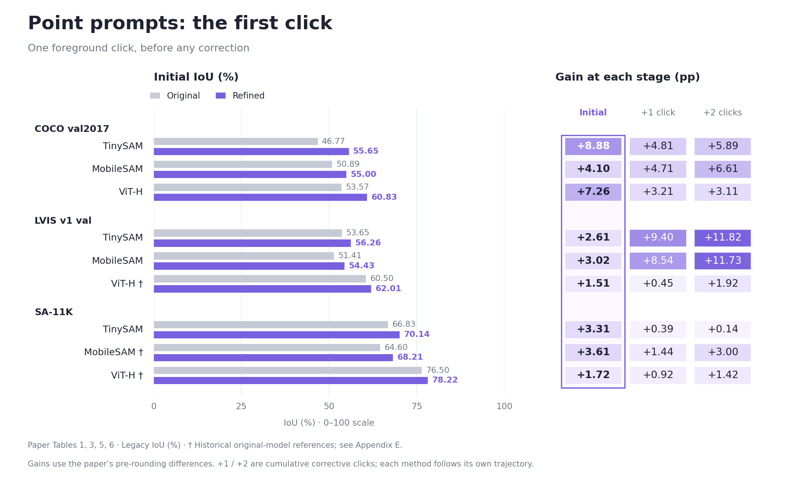
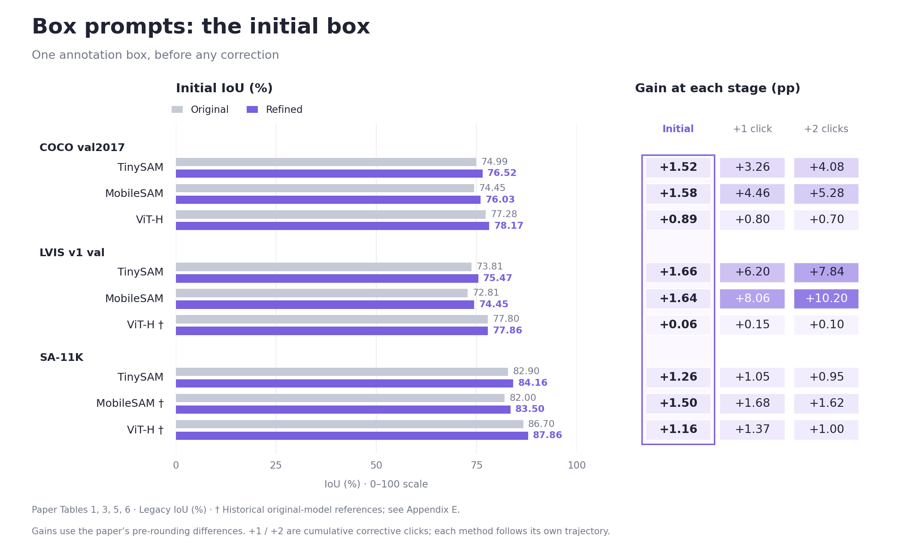
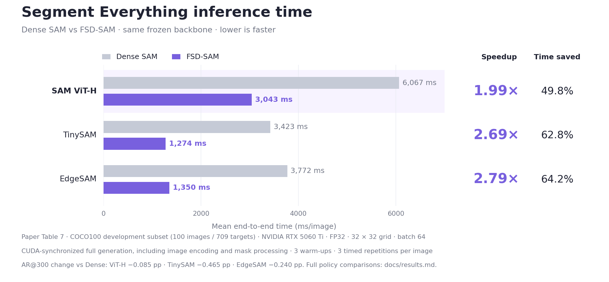

# Evaluation results

Values are transcribed from the supplied manuscript, `main.pdf`, Tables 1, 3, 5–7 (pages 11–14). Initial means one foreground center click or one GT box; +1/+2 mean cumulative corrective clicks. All interaction values are instance-averaged legacy IoU (%). Differences are copied from the paper, which calculates them before rounding. **† Historical original-model figures:** MobileSAM on SA-11K (and ViT-H on LVIS/SA-11K in the full results) are reference comparisons, not newly matched controls; see manuscript Appendix E.

Fitting, calibration and checkpoint selection use SA-1B training data only. COCO covers 4,952 annotated images / 36,335 targets; LVIS covers 19,626 valid images / 244,707 targets. The released SA-1B cap64 path covers 11,186 images / 618,098 targets. Reported baseline provenance follows Appendix E; these figures do not constitute a new evaluation.

## Point prompts

[Vector figure (SVG)](../site/assets/results/point-comparison.svg)

The bars compare the initial prompt; the adjacent columns show gains at all three stages, with the initial stage highlighted. Table values are **Original → Refined**; Δ is the gain at that same stage, in percentage points (pp).

| Dataset / backbone | **Initial IoU (%)** | **Initial Δ (pp)** | +1 click IoU (%) | +1 Δ (pp) | +2 clicks IoU (%) | +2 Δ (pp) |
|---|---:|---:|---:|---:|---:|---:|
| COCO val2017 / TinySAM | 46.77 → **55.65** | **+8.88** | 59.62 → **64.43** | +4.81 | 63.55 → **69.44** | +5.89 |
| COCO val2017 / MobileSAM | 50.89 → **55.00** | **+4.10** | 59.74 → **64.45** | +4.71 | 62.90 → **69.50** | +6.61 |
| COCO val2017 / ViT-H | 53.57 → **60.83** | **+7.26** | 67.26 → **70.47** | +3.21 | 71.69 → **74.80** | +3.11 |
| LVIS v1 val / TinySAM | 53.65 → **56.26** | **+2.61** | 53.31 → **62.70** | +9.40 | 54.51 → **66.32** | +11.82 |
| LVIS v1 val / MobileSAM | 51.41 → **54.43** | **+3.02** | 52.37 → **60.91** | +8.54 | 54.13 → **65.86** | +11.73 |
| LVIS v1 val / ViT-H † | 60.50 → **62.01** | **+1.51** | 68.10 → **68.55** | +0.45 | 70.70 → **72.62** | +1.92 |
| SA-11K / TinySAM | 66.83 → **70.14** | **+3.31** | 75.88 → **76.27** | +0.39 | 78.59 → **78.73** | +0.14 |
| SA-11K / MobileSAM † | 64.60 → **68.21** | **+3.61** | 73.40 → **74.84** | +1.44 | 76.20 → **79.20** | +3.00 |
| SA-11K / ViT-H † | 76.50 → **78.22** | **+1.72** | 83.40 → **84.32** | +0.92 | 85.10 → **86.52** | +1.42 |

## Box prompts

[Vector figure (SVG)](../site/assets/results/box-comparison.svg)

The bars compare the initial prompt; the adjacent columns show gains at all three stages, with the initial stage highlighted. Table values are **Original → Refined**; Δ is the gain at that same stage, in percentage points (pp).

| Dataset / backbone | **Initial IoU (%)** | **Initial Δ (pp)** | +1 click IoU (%) | +1 Δ (pp) | +2 clicks IoU (%) | +2 Δ (pp) |
|---|---:|---:|---:|---:|---:|---:|
| COCO val2017 / TinySAM | 74.99 → **76.52** | **+1.52** | 74.42 → **77.68** | +3.26 | 74.29 → **78.36** | +4.08 |
| COCO val2017 / MobileSAM | 74.45 → **76.03** | **+1.58** | 72.57 → **77.03** | +4.46 | 71.95 → **77.23** | +5.28 |
| COCO val2017 / ViT-H | 77.28 → **78.17** | **+0.89** | 77.76 → **78.56** | +0.80 | 78.00 → **78.70** | +0.70 |
| LVIS v1 val / TinySAM | 73.81 → **75.47** | **+1.66** | 70.37 → **76.57** | +6.20 | 69.29 → **77.13** | +7.84 |
| LVIS v1 val / MobileSAM | 72.81 → **74.45** | **+1.64** | 67.30 → **75.36** | +8.06 | 65.49 → **75.68** | +10.20 |
| LVIS v1 val / ViT-H † | 77.80 → **77.86** | **+0.06** | 78.30 → **78.45** | +0.15 | 78.50 → **78.60** | +0.10 |
| SA-11K / TinySAM | 82.90 → **84.16** | **+1.26** | 83.79 → **84.84** | +1.05 | 84.24 → **85.18** | +0.95 |
| SA-11K / MobileSAM † | 82.00 → **83.50** | **+1.50** | 82.40 → **84.08** | +1.68 | 82.70 → **84.32** | +1.62 |
| SA-11K / ViT-H † | 86.70 → **87.86** | **+1.16** | 86.70 → **88.07** | +1.37 | 87.10 → **88.10** | +1.00 |

## Segment Everything timing

[Vector figure (SVG)](../site/assets/results/fsd-time-comparison.svg)

| Backbone / policy | ms/image ↓ | Speedup | AR@300 (%) ↑ | ΔAR (pp) |
|---|---:|---:|---:|---:|
| TinySAM / Dense | 3,423 | 1.00× | 15.797 | — |
| TinySAM / Hierarchical | 1,808 | 1.89× | 16.164 | +0.367 |
| TinySAM / FSD-SAM | 1,274 | 2.69× | 15.331 | -0.465 |
| EdgeSAM / Dense | 3,772 | 1.00× | 29.803 | — |
| EdgeSAM / Hierarchical | 2,202 | 1.71× | 29.337 | -0.465 |
| EdgeSAM / FSD-SAM | 1,350 | 2.79× | 29.563 | -0.240 |
| SAM ViT-H / Dense | 6,067 | 1.00× | 48.322 | — |
| SAM ViT-H / Hierarchical | 2,966 | 2.05× | 46.093 | -2.228 |
| SAM ViT-H / FSD-SAM | 3,043 | 1.99× | 48.237 | -0.085 |

Paper Table 7: COCO100 **development subset**, 100 images / 709 targets, NVIDIA RTX 5060 Ti, FP32, 32 × 32 grid, 64 prompts/batch. Three warm-ups; each image is timed three times, with quality from repetition 0. CUDA-synchronized end-to-end generation includes encoding and mask processing. Image reading, model loading, compilation, warm-up, disk writes and GT evaluation are excluded. Seconds in the paper are converted to milliseconds (×1000). These dataset averages are separate from the live demo’s current-image measurements and portable decoder settings.

## Source

The supplied manuscript SHA256 is `60997914209376b776a5372a1ed4053670ef9773de0f90b8de6a5a1ff7398438`. Displayed interaction values use the paper’s two decimal places; timing and AR use Table 7 precision. [Machine-readable interaction values](../site/benchmarks.json) · [Machine-readable timing values](../site/paper-everything.json). Curated image IoUs are recomputed against their own target annotations and are separate from these aggregate values.

The PNG and SVG figures are generated from `site/benchmarks.json` (interaction) and `site/paper-everything.json` (timing). With matplotlib installed, run `python docs/figures/plot_prompt_results.py` or `python docs/figures/plot_everything_time.py`. The interaction figures share a 0–100 IoU axis and 0–12 pp gain color scale; the timing figure starts at 0 ms.

## TinySAM LVIS acceptance addendum

The original full inference exited successfully. Its original CPU acceptance
failed on one stored second-round point IoU: image 195271, annotation 94187,
value 1.2310324907302856. The original failed ledger/cache were preserved.
One bounded replay used the same frozen model and previous-image RNG state.
The other 134 point IoUs, all 135 candidate choices and final point RNG matched
exactly. GPU/CPU intersection 2158 and union 2323 agreed; the valid stored value
is 0.9289711713790894. An additive, single-value correction passed full CPU
coverage/range/order/reaggregation acceptance. The exact trigger of the original
out-of-range value was not reproduced or identified. No clamping, target
deletion or full GPU rerun was performed.

## TinySAM COCO1000 structure ablation

1,000 fixed validation images / 7,179 targets. The table uses server controls
for server module effects. Local/server numerical differences are preserved;
all gains are matched to a baseline on the same execution host. These results
do not isolate the causal effect of the encoding change alone.

| Prompt / configuration | Round 1 | Round 2 | Round 3 |
|---|---:|---:|---:|
| Point / native, server control | 46.466 | 63.487 | 68.789 |
| Point / first-click selector | 55.798 | 61.478 | 68.082 |
| Point / first + feedback | 55.798 | 62.631 | 67.677 |
| Point / first + residual | 55.798 | 63.027 | 69.087 |
| Point / full | 55.798 | 64.473 | 69.556 |
| Box / native | 75.095 | 76.425 | 77.054 |
| Box / current selector | 75.221 | 76.497 | 77.275 |
| Box / independent decoder | 76.411 | 77.880 | 78.545 |
| Box / full | 76.601 | 77.915 | 78.549 |

The isolated feedback path has a negative third-round effect. In the full box
trajectory, the final gain over the independent decoder is only +0.003 pp.
On the full model's *same candidate pool*, the final region-selected result is
0.027 pp below independent-native selection; these are different comparisons.
